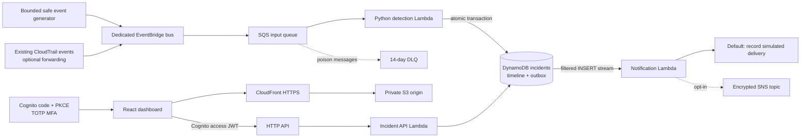
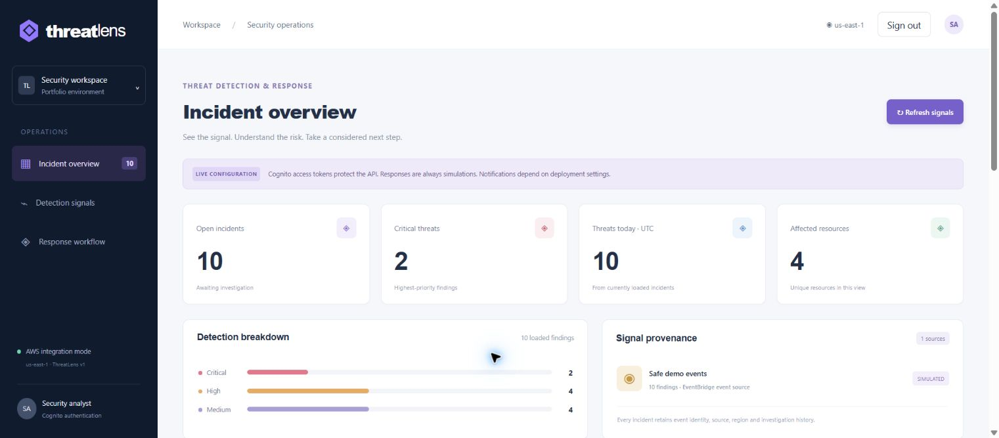
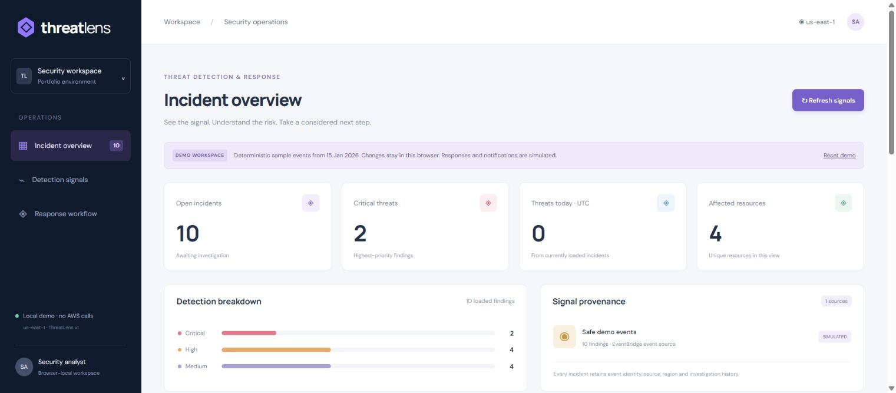
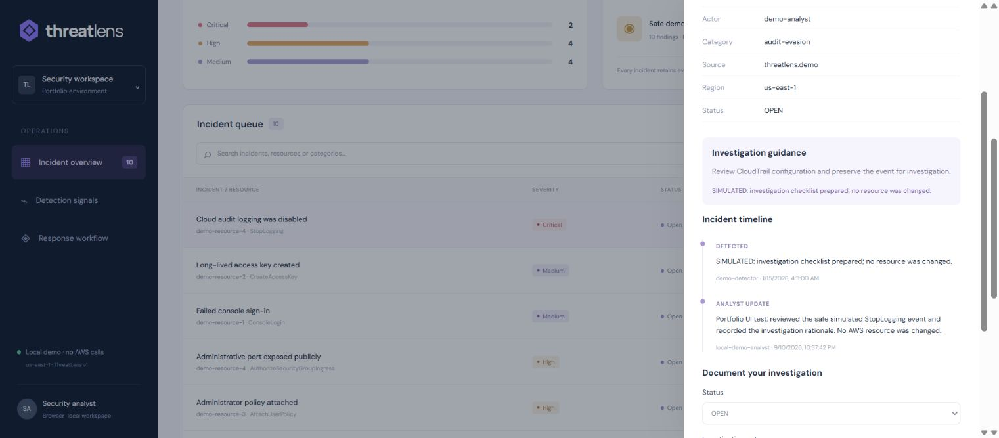

# ThreatLens

**Built and documented by Ali Adil.**

**ThreatLens is a dashboard for checking suspicious activity in an AWS account.** I built it to turn selected activity records into incidents: items that a security analyst can open, investigate, add notes to, and track over time.

## The problem I chose

I wanted to solve a practical problem for a small cloud team: an activity record can say what happened, but it does not tell the team who is investigating it or what they have found. Someone might turn off audit logging, give an account administrator access, or open remote access to the internet. Those actions need a clear place to review them. A repeated event should not create several copies of the same incident, and one person's edit should not silently overwrite another person's work.

This is a learning project using a realistic business scenario and made-up activity records. It does not describe an incident at a real customer.

## My solution and how it works

I built an application that receives activity records, checks five specific rules, and saves matching records as incidents. The dashboard shows what happened, the affected resource, and the priority. An analyst signs in, opens an incident, changes its status, and adds notes. The application keeps a history of those changes.

For example:

1. My safe test generator sends a made-up event saying that audit logging was turned off. It does not turn off any real logging.
2. EventBridge routes the event to an SQS queue, which holds it until it can be processed.
3. A Lambda function, a small program AWS runs when needed, checks the event and saves a critical incident in DynamoDB, the database.
4. An analyst signs in with a password and an authenticator-app code, then opens the incident.
5. The analyst changes the status to **Investigating** and saves a note. Reopening the incident shows the saved update and its history.
6. If the same event arrives again, the application keeps the existing incident instead of creating a duplicate.

The five rules check for audit logging being turned off or its trail deleted, administrator access being granted, remote access being opened to the internet, failed console sign-in, and creation of a long-term access key. The rules for changed settings check that the action succeeded. A failed sign-in is a reason to review activity; it is not proof that someone broke into the account.

**[Read the easy service and connection guide](docs/aws-services.md)** for every AWS service, what it did here, where it sat, and how it connected to the next step. The application helps with investigation; it does not automatically shut down servers, remove accounts, or change network access. Notifications were simulated, so the test sent no real alert emails.

## What I tested and what you can open today

I deployed and tested the application on AWS, including real sign-in and saved investigation notes. The events were made up, but the AWS processing, database, and browser checks were real. I then removed the temporary AWS environment to limit ongoing costs. See the [browser screenshots and checks](docs/live-browser.md) and [verified cleanup](docs/teardown.md).

**[Open the permanent browser demo](https://aliadiill.github.io/threatlens/).** It runs on GitHub Pages with sample incidents. Its edits stay in your browser, and it does not connect to a running AWS backend or require an AWS sign-in.

## Current evidence

| Capability | Evidence in this repository |
| --- | --- |
| Local analyst experience | Browser demo with ten sample incidents, filters, details, notes, status changes, and saved browser edits |
| Application and deployment checks | 33 Python tests cover event rules, repeat events, failed work, access checks, conflicting edits, reading multiple pages of records, notification retries, and deployment-status checks |
| Dashboard checks | Seven TypeScript tests cover the investigation workflow; the website build passed |
| Infrastructure | My Terraform configuration passed its checks. I completed the AWS setup after retrying an initial setup failure |
| AWS event processing | A 15-event test passed: ten incidents, ten simulated notification records, no extra incidents from repeated events, empty observed queues, and blocked API access without sign-in. See [runtime report](docs/live-smoke-result.json) |
| AWS release pipeline | Source → Quality → Review → Deploy all succeeded for revision ecd9440 on 11 September 2026; deployment completed 06:19:47 UTC. See [pipeline runtime report](docs/pipeline-result.json) |
| Sign-in and saved investigation | Verified sign-in with the required authenticator-app code, ten AWS-stored incidents, a saved Investigating status and note, persistence after refreshing/reopening, and sign-out clearing the dashboard. See [actual browser evidence](docs/live-browser.md) |
| Permanent demo | [GitHub Pages](https://aliadiill.github.io/threatlens/) verified from workflow run 34569307423; visibly labeled browser-only sample |
| AWS teardown | 75 managed resources removed; 38 direct absence checks and one scheduled KMS deletion confirmed. The automatic DynamoDB SYSTEM backup expires at no additional cost. See [teardown evidence](docs/teardown.md) |
| Notifications | Simulated in this deployment; sending real alerts requires a separate setting and a configured recipient |

Local demo data is **not evidence of live AWS traffic**. Its fixed timestamp is 15 January 2026, so “threats today” correctly counts zero outside that UTC date.

## Architecture



Full flows, the data model and reliability boundaries are in [architecture](docs/architecture.md).

## Actual AWS browser check

The hosted application loaded the ten synthetic AWS incidents after Cognito authentication. A saved status/note persisted after closing, refreshing from the API and reopening the incident. The [step-by-step browser record](docs/live-browser.md) includes the investigation and saved-note screenshots, sign-out result and permanent demo verification.



## Actual local screenshots

The following captures show the running browser demo, including a saved investigation note. They use fixed synthetic sample events and do not show live AWS traffic.





## Run locally

Prerequisites: Node.js 22.12+ (or supported newer LTS), Python 3.12+, and Terraform 1.10+. Use temporary AWS credentials only when intentionally deploying.

```sh
npm ci
python -m venv .venv
# Activate .venv using your operating system's usual command.
python -m pip install -r requirements-dev.txt
python -m unittest discover -s tests -v
npm test
npm run build
npm run dev
```

Open the address printed by Vite. The checked-in public configuration selects browser demo mode. This mode makes no AWS API calls. Open an incident, change its status, write a note, save, then reload to verify browser-local persistence. “Reset demo” restores the fixed sample.

Regenerate the shared fixture from the actual Python detection rules:

```sh
python scripts/build_fixture.py
python scripts/generate_events.py --count 12 --seed 7
```

The generator prints JSON unless `--send` is explicitly supplied. It publishes only custom demonstration events; it never invokes suspicious AWS operations.

## Deploy and release

Follow [deployment](docs/deployment.md), then [CI/CD](docs/ci-cd.md). Region defaults to us-east-1. Terraform needs an existing CodeConnections ARN and `owner/repository` only when enabling the optional pipeline. Account-specific settings and state must remain private.

The pipeline tests and packages the application, pauses for release review, and publishes with scoped roles. Infrastructure changes use a separately reviewed Terraform plan; the application deploy role cannot alter IAM or create infrastructure.

## Repository guide

- `src/`: dashboard, OAuth PKCE client, typed API client, deterministic demo and workflow tests.
- `backend/`: detection, SQS processing, DynamoDB persistence, authenticated API, outbox notification worker.
- `infra/`: AWS resources, scoped IAM roles, encryption, observability and optional CodePipeline.
- `scripts/`: bounded event generator, fixture generation, package/deploy helpers and source guardrails.
- `tests/`: offline behavioral tests; no AWS credentials or live side effects required.
- `docs/`: architecture, security, networking, deployment, operations, costs, decisions, evidence and interview material.

See [AWS service choices](docs/aws-services.md), [security](docs/security.md), [monitoring](docs/monitoring.md), [troubleshooting](docs/troubleshooting.md), [cost/teardown](docs/cost.md), [decisions](docs/decisions.md), and [interview preparation](docs/interview-prep.md).

The [build journal](docs/build-journal.md) records the actual implementation and deployment difficulties, their fixes, verification and remaining limits. A separate [GitHub Pages demo workflow](docs/github-pages.md) publishes the verified browser-only sample at the project base path.

## Portfolio cost report

I consolidated my planning choices, AWS-reported charges and credit balance in [my cost report](docs/cost-report.md). I keep estimates separate from posted billing and verify teardown independently.
