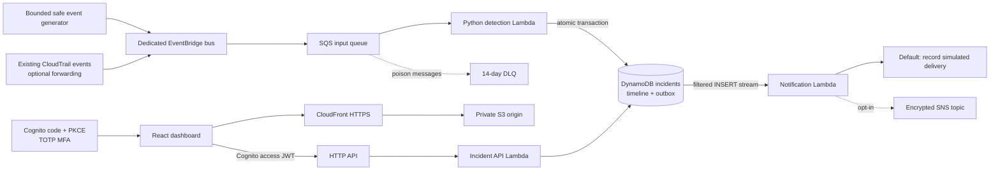

# ThreatLens

**Cloud security signals, investigated with context.** ThreatLens turns meaningful AWS activity into a shared incident workspace: classify the risk, inspect the affected resource, document the investigation, and retain the decision history.

The implementation combines a React/TypeScript dashboard, Python Lambda handlers, a transactional DynamoDB incident/outbox model, Terraform, and a GitHub → AWS CodePipeline → CodeBuild release workflow. Responses are deliberately simulated. No handler has permission or code to terminate instances, revoke identities or modify firewall rules.

## Current evidence

| Capability | Evidence in this repository |
| --- | --- |
| Local analyst experience | Working deterministic browser demo: ten findings from twelve bounded signals, filters, details, notes, status changes and persistence |
| Backend/deployment behavior | 33 offline Python tests cover detection, duplicate delivery, partial failure, authorization, concurrent edits, DynamoDB pagination, notification retries and the deployment waiter's scoped operation/failure/timeout behavior |
| Frontend behavior | Seven TypeScript tests cover the analyst workflow; production build checked |
| Infrastructure | Terraform initializes/validates; the integration lead completed the live application stack after a retried initial apply |
| AWS backend integration | Live 15-event bounded smoke passed: ten expected incidents, ten SIMULATED outboxes, unchanged identities after replay, empty observed queues and unauthenticated API 401. See [runtime report](docs/live-smoke-result.json) |
| Hosted sign-in and CI/CD execution | Independent integration checks; do not infer them from source files or the backend smoke. See [testing evidence](docs/testing.md) and integration notes |
| Notifications | Disabled by default; real SNS publishes require an explicit deployment setting and authorized destination |

Local demo data is **not evidence of live AWS traffic**. Its fixed timestamp is 15 January 2026, so “threats today” correctly counts zero outside that UTC date.

## Architecture



Full flows, the data model and reliability boundaries are in [architecture](docs/architecture.md).

## Actual local screenshots

The following captures show the running browser demo, including a saved investigation note. They use fixed synthetic sample events and do not show live AWS traffic.


## Run locally

Prerequisites: Node.js 22.12+ (or supported newer LTS), Python 3.12+, and Terraform 1.10+. Use temporary AWS credentials only when intentionally deploying.

```sh
npm ci
python -m venv .venv
# Activate .venv using your operating system's usual command.
python -m pip install -r requirements-dev.txt
python -m unittest discover -s tests -v
npm test
npm run build
npm run dev
```

Open the address printed by Vite. The checked-in public configuration selects browser demo mode. This mode makes no AWS API calls. Open an incident, change its status, write a note, save, then reload to verify browser-local persistence. “Reset demo” restores the fixed sample.

Regenerate the shared fixture from the actual Python detection rules:

```sh
python scripts/build_fixture.py
python scripts/generate_events.py --count 12 --seed 7
```

The generator prints JSON unless `--send` is explicitly supplied. It publishes only custom demonstration events; it never invokes suspicious AWS operations.

## Deploy and release

Follow [deployment](docs/deployment.md), then [CI/CD](docs/ci-cd.md). Region defaults to us-east-1. Terraform needs an existing CodeConnections ARN and `owner/repository` only when enabling the optional pipeline. Account-specific settings and state must remain private.

The pipeline tests and packages the application, pauses for release review, and publishes with scoped roles. Infrastructure changes use a separately reviewed Terraform plan; the application deploy role cannot alter IAM or create infrastructure.

## Repository guide

- `src/`: dashboard, OAuth PKCE client, typed API client, deterministic demo and workflow tests.
- `backend/`: detection, SQS processing, DynamoDB persistence, authenticated API, outbox notification worker.
- `infra/`: AWS resources, scoped IAM roles, encryption, observability and optional CodePipeline.
- `scripts/`: bounded event generator, fixture generation, package/deploy helpers and source guardrails.
- `tests/`: offline behavioral tests; no AWS credentials or live side effects required.
- `docs/`: architecture, security, networking, deployment, operations, costs, decisions, evidence and interview material.

See [AWS service choices](docs/aws-services.md), [security](docs/security.md), [monitoring](docs/monitoring.md), [troubleshooting](docs/troubleshooting.md), [cost/teardown](docs/cost.md), [decisions](docs/decisions.md), and [interview preparation](docs/interview-prep.md).
