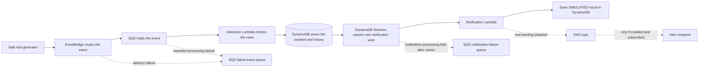
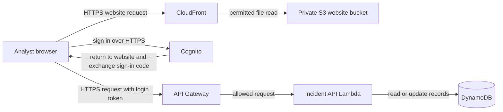

# ThreatLens: what each service did and how it connected

[Back to the project](../README.md)

## What I built and why

I built ThreatLens to help a small cloud team investigate suspicious AWS activity. A raw activity record describes an action, but it has no investigation status, analyst notes, or history of decisions. My solution turns selected records into incidents and gives the team a shared dashboard to work on them.

This was a learning project with made-up events. I deployed and tested the application on AWS, including sign-in and saved notes, then removed the temporary environment to limit ongoing costs. The [GitHub Pages demo](https://aliadiill.github.io/threatlens/) now runs with sample data inside the browser. It is separate from the former AWS application.

## Where the parts lived

The application used AWS-managed services. **I did not create a VPC, public subnet, private subnet, NAT Gateway, or EC2 server for ThreatLens.** The Lambda functions were not attached to a project VPC. Private access here meant access controlled by permissions and sign-in; it did not mean every service lived in a private subnet.

| Part | Where it lived and who could reach it |
| --- | --- |
| Browser | On the analyst's computer. It downloaded the website, signed in, and made its own API requests. |
| CloudFront | AWS's website-delivery service, outside any project VPC. Its public HTTPS address served the dashboard files. |
| S3 website bucket | AWS-managed storage with public access blocked. The configured CloudFront distribution could read the website files. A visitor did not receive direct access to the bucket. |
| Cognito | A public HTTPS sign-in service. It checked the analyst's password and authenticator-app code. |
| API Gateway | A public HTTPS API address. Protected requests needed a valid login token; being reachable on the internet did not give someone access to incidents. |
| Lambda, DynamoDB, EventBridge, SQS, SNS, and KMS | AWS-managed services. Their roles and permissions controlled which parts could call each other. The browser had no direct database, queue, or notification-service access. |
| Pipeline files | A separate private S3 bucket that the release tools could access. It was not the dashboard's website bucket. |

An **API** is an agreed way for one program to ask another program for something. A **token** is short-lived proof of a successful sign-in. An **IAM role** is a list of actions a program is allowed to perform in AWS.

## 1. From an activity event to an incident

Here is one example, step by step:

1. **My safe generator sends a made-up event.** The example says that audit logging was turned off. It does not actually turn off logging or perform an attack.
2. **EventBridge receives the event.** Its project event bus is a named place to receive events. A routing rule recognizes an accepted source and sends the record to SQS. Routing is different from deciding whether an event is suspicious.
3. **SQS holds the event.** The detection worker can process it when ready. If several events arrive together, the queue holds the waiting work.
4. **Lambda reads a group of messages and checks each one.** The Python rules examine the action and its result. In this example, successful removal of audit logging becomes a critical incident.
5. **Lambda saves three related records in DynamoDB together:** the incident, its first history entry, and a notification to-do record. If that save cannot finish, the whole save fails rather than leaving a partly created incident.
6. **If the same event arrives again, its stable identifier finds the existing incident.** The application avoids creating another incident and another initial notification record.

The other rules cover successful administrator access being granted, successful exposure of remote access to the internet, failed console sign-in, and successful creation of a long-term access key. A failed sign-in is a reason to review activity, not proof of a break-in.

| Service | Exactly what it did here | Why I used it |
| --- | --- | --- |
| **Amazon EventBridge** | Received events and sent matching records to the project input queue. The rule had permission to send only to the intended queue. | It connected the event source to the processing system. |
| **Amazon SQS** | Held incoming records, allowed retries, and used AWS-managed encryption for saved messages. | A burst of activity or temporary worker failure should not require immediately dropping work. |
| **AWS Lambda — detection worker** | Validated each record, applied the rules, and saved incidents. It reported failed items separately so successful items did not all need to be retried with them. | Small event-handling jobs could run when needed without maintaining a server. |
| **Amazon DynamoDB** | Stored the incident details, priority, affected resource, status, version, history, and notification work. | The dashboard and workers needed reliable saved records to find and update. |

The processing Lambda could access its input queue and incident table. It did not have permission to remove accounts, terminate servers, or change firewall rules. ThreatLens prepared information for an investigation; it did not automatically contain an attack.

## 2. What happened to notification work and failures

The notification to-do record is called an **outbox** in the code. It is a saved reminder to handle the notification for an incident, not someone's email inbox.

1. **DynamoDB Streams reports a newly saved outbox record.** A filter selects these new records instead of sending every table change to the notification worker.
2. **The notification Lambda reads that work.** In the tested configuration, it saves a `SIMULATED` result in DynamoDB.
3. **SNS was created, but real sending was disabled.** If a future deployment enables notifications and configures a subscriber, the worker can send an incident summary to the SNS topic. SNS can then deliver it to the subscriber.
4. **KMS provides the encryption key for that SNS topic.** The notification role includes only the needed access to the project topic and key. The key is not the incident database and does not decide whether an event is suspicious.

| Service or connection | Its exact role |
| --- | --- |
| **DynamoDB Streams → notification Lambda** | Starts processing newly created notification work after the incident is saved. Streams is a DynamoDB feature for reporting table changes. |
| **Notification Lambda → DynamoDB** | Reads notification work and marks it simulated, or sent if real sending is enabled and succeeds. |
| **Notification Lambda → SNS** | Optional real notification route. This route did not send messages in the demonstration. |
| **SNS → AWS KMS** | Uses the project key to protect stored SNS message data when the notification path is used. |
| **EventBridge → failed-event SQS queue** | Keeps events that EventBridge cannot deliver to the input queue after its retry limits. |
| **Input SQS queue → failed-event SQS queue** | Moves records that still cannot be processed after five receives. |
| **Notification stream processing → separate failure SQS queue** | Keeps failure information when notification work exceeds its retry or age limits. This may contain references to failed work rather than the full incident. The saved outbox remains the recovery source. |

A failed-work queue is often called a **dead-letter queue**, or DLQ. It gives someone a place to investigate failed processing. The live test observed empty queues; it did not deliberately create a failure and prove recovery from a DLQ. Real email delivery was not tested, and retries do not guarantee an email can never be sent twice.

## 3. Opening the website and signing in

1. **The browser opens CloudFront's HTTPS address.** CloudFront serves the dashboard's files, using its cache when appropriate or fetching them from the private S3 website bucket.
2. **S3 checks CloudFront's permission.** The bucket permits the configured distribution to read files. Direct public bucket access is blocked.
3. **The downloaded dashboard runs in the browser.** Its configuration tells it the Cognito sign-in address and API address.
4. **The browser redirects the analyst to Cognito.** Cognito checks the password and required changing code from an authenticator app. New public self-sign-up was disabled; analysts were created by an administrator.
5. **Cognito redirects back to the website with a short-lived sign-in code.** The browser exchanges that code with Cognito over HTTPS and receives tokens. The exchange uses an extra protection called PKCE so the browser can prove it started that login attempt.
6. **The browser keeps the access token in memory.** The dashboard can now ask for incidents. CloudFront serves the website files; the browser calls the API directly. API requests do not pass through the project's CloudFront distribution.

| Service | Why it was needed |
| --- | --- |
| **Amazon S3 — website bucket** | Held the HTML, JavaScript, and styles that made up the dashboard. It did not hold the incident database. |
| **Amazon CloudFront** | Provided the public HTTPS website address and added browser security headers while keeping the S3 bucket private. |
| **Amazon Cognito** | Supplied account sign-in and the required second verification step without a custom password system. |

The AWS-provided CloudFront hostname supplied HTTPS. I did not purchase a domain or create a separate ACM certificate. The exact connection-security limits are retained in [security](security.md).

## 4. Listing incidents, saving a note, and signing out

1. **The browser calls API Gateway over HTTPS.** It sends the login token with a request such as "List incidents" or "Open this incident."
2. **API Gateway checks the token.** It checks that the expected sign-in service issued it, that it is for this application, and that the requested access is allowed. Requests without valid sign-in are rejected.
3. **API Gateway invokes the incident API Lambda.** That worker also checks the user identity and follows the application's rules.
4. **Lambda reads DynamoDB.** It returns the incident data through API Gateway to the browser, which draws the list or detail screen. The browser never receives direct table permissions.
5. **The analyst writes a note or changes a status.** The browser sends the change and the incident version it last read through the same API route.
6. **Lambda checks the version and saves the update with its history.** If another person has already changed the incident, the old edit is rejected so the analyst can refresh rather than overwrite someone else's work.
7. **The browser refreshes the incident.** The saved status and note come from DynamoDB, demonstrating that the live AWS result was saved beyond the screen itself.
8. **Signing out clears the browser's login state and displayed incidents, then redirects through Cognito's logout page.** Without a valid token, the protected API cannot be used to load incidents again. This browser check did not prove immediate revocation of an already copied access token.

| Service | Exactly what it did |
| --- | --- |
| **Amazon API Gateway — HTTP API** | Provided the list, detail, and update routes; checked login tokens; applied request limits; and restricted which website could make browser requests. The website-origin restriction is not a substitute for sign-in checks. |
| **AWS Lambda — incident API** | Enforced the request and editing rules, read incident records, and saved allowed changes. |
| **Amazon DynamoDB** | Kept the incident and its change history, and rejected updates based on an outdated version. |

All provisioned analysts shared this learning workspace. Different customer workspaces or separate analyst permission levels were not demonstrated.

## 5. How access, logs, and recovery connected

| Service or feature | What it connected to and why |
| --- | --- |
| **AWS IAM roles and policies** | Gave separate permissions to the three Lambda workers, pipeline, and build workers. For example, the API role could work with incident records, while the notification role could handle notification records and the project SNS topic. |
| **AWS Security Token Service — STS** | Supports the temporary credentials used when AWS services take on those IAM roles. Account-identity checks also confirmed which account the deployment was using. It was not an analyst login system; Cognito handled that. |
| **Amazon CloudWatch Logs** | Received function, API, and build logs so errors could be investigated. Application logs were retained for fourteen days and avoided storing full sensitive activity payloads. |
| **Amazon CloudWatch metrics and alarms** | Used function-error counts, failed-queue counts, and the age of the oldest waiting input message to show processing trouble. The alarms had no external notification actions by default. |
| **DynamoDB point-in-time recovery** | Allowed recovery to an earlier point within the configured seven-day window. It was configured, but a live table restore was not performed. |
| **S3 encryption, versioning, and cleanup rules** | Protected saved files, kept previous versions, and limited how long old versions remained. These were settings on the two S3 buckets rather than separate running servers. |

Logs explain what happened; metrics count or measure it; alarms highlight a concerning measurement. No live alarm-delivery test was performed.

## 6. From a GitHub change to a deployed application

**GitHub → CodeConnections → CodePipeline → CodeBuild checks → human review → CodeBuild deployment → S3 website files and three Lambda functions.**

1. **GitHub holds the source code.** A commit records a specific version of the project.
2. **CodeConnections gives the pipeline access to that repository.** The deployment used an existing shared GitHub connection.
3. **CodePipeline starts its Source stage.** It collects the selected code and passes the package through a private S3 artifact bucket. An artifact is simply a file produced or used by a build.
4. **The Quality stage starts a CodeBuild worker.** That temporary worker checks, tests, and packages the application. Its output package goes into the artifact bucket for the next stage.
5. **The Review stage waits for a human decision.** The application is not deployed merely because packaging finished.
6. **The Deploy stage starts its CodeBuild worker.** It updates the three Lambda functions, waits for updates to finish, uploads website files to the website bucket, and asks CloudFront to clear old cached files.
7. **IAM limits each worker, and CloudWatch Logs records the work.** The application deployment role cannot create infrastructure or change IAM. Terraform infrastructure changes remain a separate step.

| Service | Why I used it |
| --- | --- |
| **AWS CodeConnections** | A controlled link between GitHub and the AWS source stage. |
| **AWS CodePipeline** | Coordinated the release stages in a repeatable order. |
| **AWS CodeBuild** | Supplied the temporary computers that performed checks, packaging, and deployment. |
| **Amazon S3 — pipeline artifact bucket** | Held the exact files being passed between release stages. It was private and separate from the website bucket. |
| **AWS IAM and CloudWatch Logs** | Limited release permissions and retained evidence of success or failure. |

The live pipeline passed all four stages on 11 September 2026. See the [pipeline result](pipeline-result.json) and [release guide](ci-cd.md). The shared CodeConnections connection was retained after the project environment was removed.

## Optional input and separate cost checks

**CloudTrail forwarding was optional.** The code can forward selected existing CloudTrail activity events from the default EventBridge bus to the project bus. Turning on that option does not create a CloudTrail trail. The recorded live test used safe custom events, so it does not prove detection of real attacks in the account.

I did not activate GuardDuty or Security Hub, or deploy OpenSearch, RDS, a Docker application, or an EC2 fleet for this project. CodeBuild used its own temporary AWS-managed container to run release tasks; the application itself ran in Lambda. ThreatLens checked five narrow rules; it did not collect or investigate every kind of security event.

**AWS Billing, Cost Explorer, and Free Tier were separate read-only portfolio checks.** I used them to review reported account charges, credits, and plan information. They did not process incidents or serve the website. The snapshot covered the account, including earlier learning activity; it was not a final bill for ThreatLens alone. See [my cost report](cost-report.md) and [detailed billing snapshot](credit-budget-verification.md).

## Tools outside AWS

| Tool | What I used it for |
| --- | --- |
| **Terraform** | Described the AWS resources in files so I could review, create, change, and remove the environment. Infrastructure as code means a written recipe for infrastructure. |
| **Python** | Wrote the event rules, three Lambda workers, safe event generator, and deployment helpers. |
| **AWS SDK for Python — Boto3** | Let the Python code call the required AWS services. The AWS CLI also supported setup and operating instructions. These are tools for calling AWS, not separate hosted services. |
| **React and TypeScript** | Built the dashboard, incident screens, filters, notes, and browser sign-in handling. TypeScript helped check the expected shapes of data. |
| **Node.js, npm, and Vite** | Installed development tools, ran the local website, and built its files for publishing. |
| **Python unittest and Vitest** | Checked application behavior, including repeated events, saved edits, access checks, and failures. |
| **Git and GitHub** | Recorded changes as commits and stored source, documentation, diagrams, screenshots, and test evidence. |
| **GitHub Actions and GitHub Pages** | Built and published the permanent sample dashboard. This workflow is separate from AWS CodePipeline. The Pages demo stores edits in the browser and makes no AWS API calls. |

## What the evidence proves and what exists today

The live AWS event test submitted twelve initial events and three repeated events. It created ten incidents and ten simulated notification records. Repeated events did not create extra incidents, and an API request without sign-in was blocked. In the hosted browser test, I signed in with the required authenticator code, opened an incident, saved its status and a note, refreshed it, and confirmed the changes remained saved.

I then removed the temporary application. The cleanup recorded 75 managed resources removed; that includes settings and permissions, not 75 servers. It also documented the key's scheduled deletion and the automatic temporary database backup. Full-account cleanup was not the scope of that project teardown. The public preview remains on GitHub Pages with browser-only sample data.

- [AWS event-test results](live-smoke-result.json)
- [Actual browser checks and screenshots](live-browser.md)
- [Cleanup results](teardown.md)
- [Build difficulties and fixes](build-journal.md)

For deeper detail, see [architecture](architecture.md), [security](security.md), [monitoring](monitoring.md), and [deployment](deployment.md). Those pages preserve the settings and commands needed to understand or rebuild the environment.
