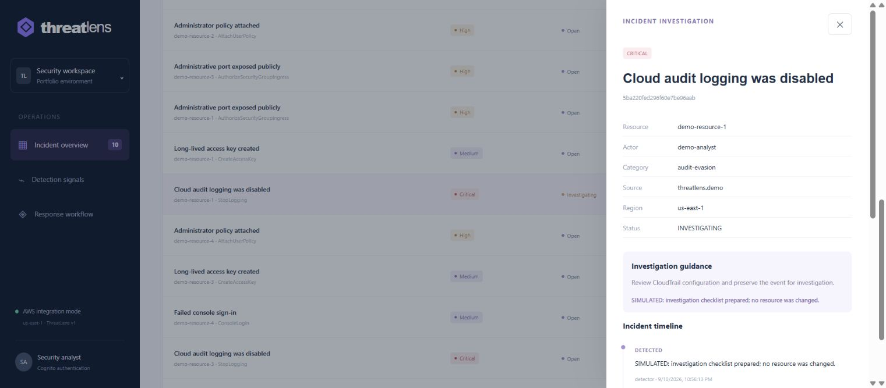
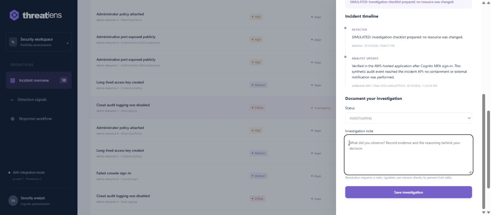
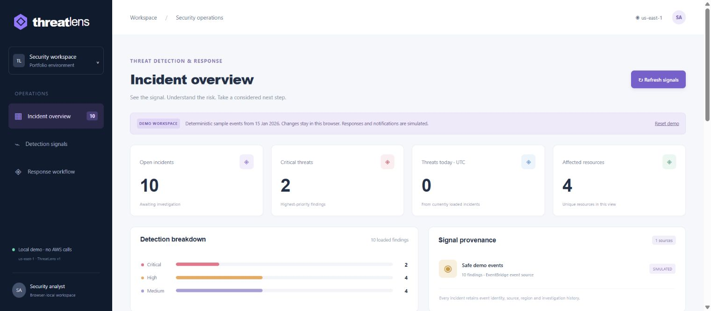

# Verified hosted browser acceptance

The integration lead performed these checks against the deployed AWS application on 11 September 2026 UTC, after the corrected [application pipeline](pipeline-result.json) succeeded. These screenshots contain actual hosted application results from safe synthetic events. They are distinct from the browser-local sample.

## Actual sequence and results

1. Provisioned a temporary analyst in this application's Cognito pool with `MessageAction=SUPPRESS`. This avoided sending an invitation email. Credentials and the TOTP enrollment secret remained private; none are included in the repository or screenshots.
2. Opened the CloudFront-hosted application and selected sign-in. Cognito handled the authorization-code flow with PKCE. The analyst completed the required TOTP enrollment and authentication.
3. Returned to the live dashboard and loaded ten incidents from the deployed API. These were the known synthetic events from the bounded AWS smoke, not real attacks or the localStorage fixture.
4. Opened critical incident `5ba220fed296f60e7be96aab`, changed its state from OPEN to INVESTIGATING and saved an investigation note.
5. Closed the incident, refreshed the dashboard from the API and reopened it. The saved status and note remained in the incident timeline. This verifies persistence beyond the open drawer state.
6. Signed out. The dashboard returned to its sign-in view, cleared the displayed incidents to zero and disabled Refresh.

The separate backend smoke had already confirmed unauthenticated API requests receive 401. The browser sequence adds hosted Cognito authentication and a real persisted analyst edit; it does not establish penetration testing, tenant isolation, real SNS delivery, disaster recovery or production capacity.

## Captured evidence

Authenticated AWS dashboard with ten synthetic incidents:

Live investigation after the status change:

Saved note visible in the persisted timeline after refresh/reopen:

## Permanent demonstration

The integration lead also verified the deployed [GitHub Pages demo](https://aliadiill.github.io/threatlens/) from [workflow run 34569307423](https://github.com/aliadiill/threatlens/actions/runs/34569307423). This is an explicitly labeled browser-only sample, with empty AWS connection settings and local browser persistence. GitHub About, topics, website and Deployments metadata were configured.

After acceptance, the AWS learning stack was removed and independently checked. See the [verified teardown](teardown.md). The public Pages demo and repository evidence remain; their availability does not imply that the live AWS backend is still running.
